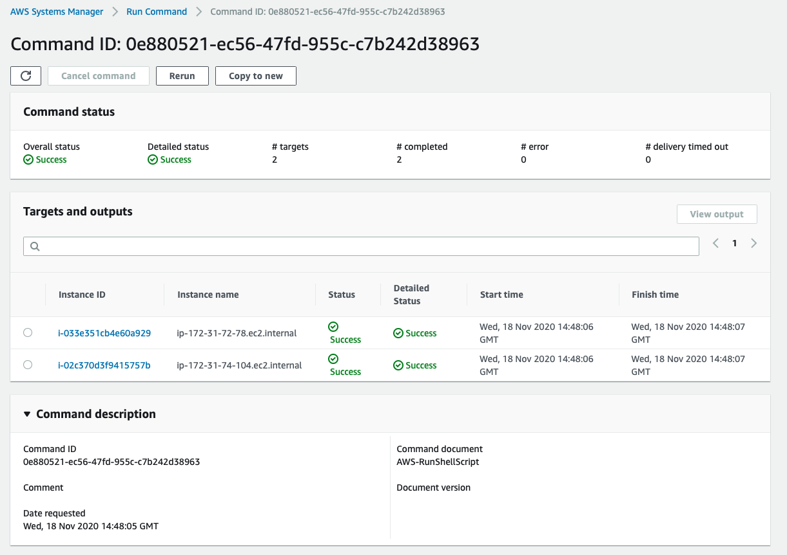
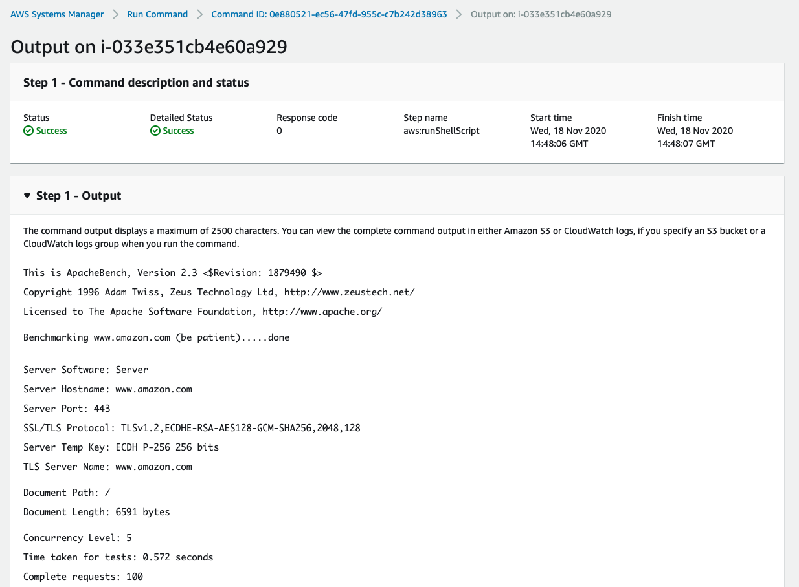

## AWS AB Util 

AWS AB Util is a utility CLI tool to manage deployment and execution of distributed Load Test using AB (Apache Bench) using AWS SSM and EC2.


## Install
```
git clone https://github.com/aws-samples/aws-ab-util.git
mv aws-ab-util/aws-ab-util /usr/local/bin/
rm -fr aws-ab-util
```

## Usage
Overall options.
```
# aws-ab-util
Usage: aws-ab-util <command> [parameters]
  run threads requests url
  create servers_count
  delete
```

Creating 2x load test servers.
```
# aws-ab-util create 2
Creating Load Test Servers...
```

Running a load test with 100 requests, per thread, per server.
It will result in 1.000 request (100 requests x 5 threads  x 2 servers).
```
# aws-ab-util run 5 100 https://www.myserver.com/
Running Load Test...
```

Deleting servers
```
# aws-ab-util delete
Deleting Load Test Servers...
```

## Uninstall
```
rm /usr/loca/bin/aws-ab-util
```

## Screenshots




## Security

See [CONTRIBUTING](CONTRIBUTING.md#security-issue-notifications) for more information.

## License

This library is licensed under the MIT-0 License. See the LICENSE file.

