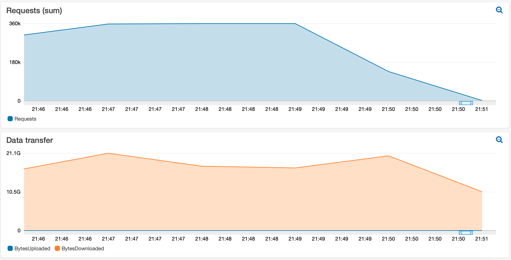

## AWS AB Util 

AWS AB Util is a CLI utility tool to manage deployment and execution of distributed load test with AB (Apache Bench) using AWS SSM and Amazon EC2. It can generate thousands of RPS (Requests per Second) and/or Gigabytes per second of data transfer.

## Requirements
- OS: Linux, MacOS
- Software: [AWS CLI](https://aws.amazon.com/cli/)
- AWS CLI with permissions to execute AWS SSM Run Command and Amazon EC2 Admin Access
- AWS IAM Role named **SSMInstanceProfile** as described in the SSM [documentation](https://docs.aws.amazon.com/systems-manager/latest/userguide/setup-instance-profile.html#instance-profile-add-permissions)

## Install
```
git clone https://github.com/aws-samples/aws-ab-util.git
sudo mv aws-ab-util/aws-ab-util /usr/local/bin/
rm -fr aws-ab-util
```

## Usage
Overall options.
```
# aws-ab-util
Usage: aws-ab-util <command> [parameters]
  run [ab-options] [http[s]://]hostname[:port]/path
  create servers_count
  delete
```


Creating 2x load test servers.
```
# aws-ab-util create 2
Creating Load Test Servers...
```


Running a load test with 100 requests, per thread, per server. This will result in 1.000 request (100 requests x 5 threads  x 2 servers).
```
# aws-ab-util run -c 5 -n 100 https://www.amazon.com/
Sending SSM Command...
Running Load Test...
Status: Success Success
Detail: https://console.aws.amazon.com/systems-manager/run-command/00000000-1111-2222-3333-444444444444
```

Deleting servers
```
# aws-ab-util delete
Deleting Load Test Servers...
```

## SSM Run Command View


## Load Test Results Example


## Uninstall
```
sudo rm /usr/local/bin/aws-ab-util
```

## Troubleshooting
Error: Invalid IAM Instance Profile name

Resolution: Create an IAM Role named **SSMInstanceProfile**, trusting in **EC2** entity, with **AmazonSSMManagedInstanceCore** policy attached [(documentation)](https://docs.aws.amazon.com/systems-manager/latest/userguide/setup-instance-profile.html#instance-profile-add-permissions).


## Security

See [CONTRIBUTING](CONTRIBUTING.md#security-issue-notifications) for more information.

## License

This library is licensed under the MIT-0 License. See the LICENSE file.
